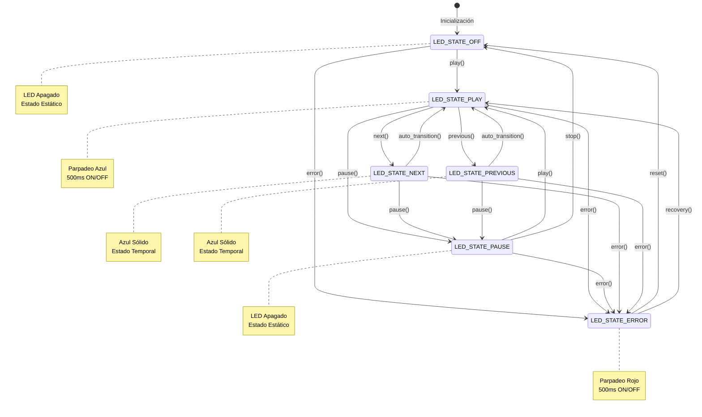

# 🚨 LED Controller Component

Un componente avanzado para control de LED RGB con máquina de estados implementada en FreeRTOS para ESP32-S2 Kaluga Kit.

## 📋 Tabla de Contenidos

- [🎯 Descripción](#-descripción)
- [🏗️ Arquitectura](#️-arquitectura)
- [📊 Diagrama de Estados](#-diagrama-de-estados)
- [🔧 API Reference](#-api-reference)
- [⚡ Uso Rápido](#-uso-rápido)
- [📝 Ejemplo Completo](#-ejemplo-completo)
- [🎨 Estados Visuales](#-estados-visuales)
- [⚙️ Configuración](#️-configuración)
- [🔍 Troubleshooting](#-troubleshooting)

## 🎯 Descripción

Este componente proporciona un control inteligente del LED RGB embebido en la ESP32-S2 Kaluga Kit a través de una máquina de estados thread-safe. Permite cambios de estado no bloqueantes con efectos visuales automáticos como parpadeos y colores sólidos.

### ✨ Características Principales

- 🎛️ **Máquina de Estados**: Control automático basado en estados
- 🔄 **Thread-Safe**: Cambios de estado desde múltiples tareas
- ⚡ **No Bloqueante**: Parpadeos automáticos sin bloquear el hilo principal
- 🎨 **Efectos Visuales**: Parpadeos y colores sólidos automáticos
- 🚀 **Eficiente**: Optimizado para minimizar uso de CPU y logs spam
- 🔧 **Fácil Integración**: API simple con solo cambiar una variable

## 🏗️ Arquitectura

```
┌─────────────────────────────────────────────────────────────┐
│                    LED Controller Component                 │
├─────────────────────────────────────────────────────────────┤
│                                                             │
│  ┌─────────────┐    ┌─────────────┐    ┌─────────────┐     │
│  │ Application │───▶│  LED API    │───▶│ State Queue │     │
│  │   Thread    │    │ (Public)    │    │ (Thread Safe│     │
│  └─────────────┘    └─────────────┘    └─────────────┘     │
│                            │                   │           │
│                            ▼                   ▼           │
│  ┌─────────────────────────────────────────────────────┐   │
│  │            LED Controller Task                      │   │
│  │  ┌─────────────────────────────────────────────┐    │   │
│  │  │          State Machine Engine               │    │   │
│  │  │                                             │    │   │
│  │  │  ┌─────────┐  ┌─────────┐  ┌─────────┐     │    │   │
│  │  │  │   OFF   │  │  PLAY   │  │  ERROR  │     │    │   │
│  │  │  │ (Static)│  │(Blink)  │  │ (Blink) │     │    │   │
│  │  │  └─────────┘  └─────────┘  └─────────┘     │    │   │
│  │  │                                             │    │   │
│  │  │  ┌─────────┐  ┌─────────┐                  │    │   │
│  │  │  │  PAUSE  │  │  NEXT/  │                  │    │   │
│  │  │  │ (Static)│  │PREVIOUS │                  │    │   │
│  │  │  └─────────┘  │(Static) │                  │    │   │
│  │  │              └─────────┘                  │    │   │
│  │  └─────────────────────────────────────────────┘    │   │
│  └─────────────────────────────────────────────────────┘   │
│                            │                               │
│                            ▼                               │
│  ┌─────────────────────────────────────────────────────┐   │
│  │               WS2812 LED Driver                     │   │
│  │         (Hardware Abstraction Layer)               │   │
│  └─────────────────────────────────────────────────────┘   │
└─────────────────────────────────────────────────────────────┘
```

### 🧩 Componentes de la Arquitectura

#### 1. **API Pública (Thread-Safe)**
- `led_set_state()`: Cambio de estado no bloqueante
- `led_get_state()`: Consulta del estado actual
- `led_controller_init()`: Inicialización del sistema
- `led_controller_deinit()`: Limpieza de recursos

#### 2. **Cola de Estados (Queue)**
- Buffer thread-safe para comandos de cambio de estado
- Capacidad: 10 elementos
- Timeout configurable para operaciones

#### 3. **Tarea Controladora**
- Prioridad: 5 (configurable)
- Stack: 2048 bytes
- Frecuencia: 10ms (parpadeos) / 100ms (estados estáticos)

#### 4. **Motor de Máquina de Estados**
- Control de transiciones automáticas
- Optimización de acciones redundantes
- Gestión de temporizadores para parpadeos

## 📊 Diagrama de Estados



## 🔧 API Reference

### Tipos de Datos

```c
typedef enum {
    LED_STATE_OFF = 0,       // LED apagado
    LED_STATE_PLAY,          // LED parpadeando azul (reproduciendo)
    LED_STATE_PAUSE,         // LED apagado (pausado)
    LED_STATE_NEXT,          // LED azul sólido (cambio de pista)
    LED_STATE_PREVIOUS,      // LED azul sólido (cambio de pista)
    LED_STATE_ERROR          // LED rojo parpadeando (error)
} led_state_t;
```

### Funciones Principales

#### `esp_err_t led_controller_init(led_strip_t *strip)`
Inicializa el controlador del LED con máquina de estados.

**Parámetros:**
- `strip`: Puntero al LED strip previamente inicializado

**Retorna:**
- `ESP_OK`: Inicialización exitosa
- `ESP_ERR_INVALID_ARG`: Parámetro inválido
- `ESP_ERR_NO_MEM`: Error de memoria

**Ejemplo:**
```c
led_strip_t *strip;
ESP_ERROR_CHECK(led_init(&strip));
ESP_ERROR_CHECK(led_controller_init(strip));
```

#### `void led_set_state(led_state_t new_state)`
Cambia el estado del LED de forma thread-safe y no bloqueante.

**Parámetros:**
- `new_state`: Nuevo estado del LED

**Ejemplo:**
```c
led_set_state(LED_STATE_PLAY);  // Inicia parpadeo azul
led_set_state(LED_STATE_PAUSE); // Apaga LED
```

#### `led_state_t led_get_state(void)`
Obtiene el estado actual del LED.

**Retorna:**
- Estado actual del LED

**Ejemplo:**
```c
led_state_t current = led_get_state();
if (current == LED_STATE_ERROR) {
    // Manejar error
}
```

#### `void led_controller_deinit(void)`
Limpia recursos y apaga el LED.

**Ejemplo:**
```c
led_controller_deinit();
```

## ⚡ Uso Rápido

```c
#include "led.h"

void app_main(void) {
    // 1. Inicializar LED básico
    led_strip_t *strip;
    ESP_ERROR_CHECK(led_init(&strip));
    
    // 2. Inicializar controlador con máquina de estados
    ESP_ERROR_CHECK(led_controller_init(strip));
    
    // 3. Usar el LED (¡Así de simple!)
    led_set_state(LED_STATE_PLAY);     // Parpadeo azul
    vTaskDelay(pdMS_TO_TICKS(5000));   // Esperar 5 segundos
    
    led_set_state(LED_STATE_PAUSE);    // Apagar
    vTaskDelay(pdMS_TO_TICKS(2000));   // Esperar 2 segundos
    
    led_set_state(LED_STATE_ERROR);    // Parpadeo rojo
}
```

## 📝 Ejemplo Completo

```c
#include "freertos/FreeRTOS.h"
#include "freertos/task.h"
#include "esp_log.h"
#include "led.h"

static const char *TAG = "LED_EXAMPLE";

// Tarea que simula eventos de audio
void audio_events_task(void *pvParameters) {
    ESP_LOGI(TAG, "🎵 Simulando eventos de audio...");
    
    while (1) {
        // Simular comando PLAY
        ESP_LOGI(TAG, "▶️ PLAY");
        led_set_state(LED_STATE_PLAY);
        vTaskDelay(pdMS_TO_TICKS(3000));
        
        // Simular comando NEXT
        ESP_LOGI(TAG, "⏭️ NEXT");
        led_set_state(LED_STATE_NEXT);
        vTaskDelay(pdMS_TO_TICKS(1000));
        
        // Volver a PLAY
        led_set_state(LED_STATE_PLAY);
        vTaskDelay(pdMS_TO_TICKS(2000));
        
        // Simular comando PAUSE
        ESP_LOGI(TAG, "⏸️ PAUSE");
        led_set_state(LED_STATE_PAUSE);
        vTaskDelay(pdMS_TO_TICKS(2000));
        
        // Simular ERROR
        ESP_LOGI(TAG, "❌ ERROR");
        led_set_state(LED_STATE_ERROR);
        vTaskDelay(pdMS_TO_TICKS(2000));
        
        // Resetear
        ESP_LOGI(TAG, "🔄 RESET");
        led_set_state(LED_STATE_OFF);
        vTaskDelay(pdMS_TO_TICKS(1000));
    }
}

void app_main(void) {
    ESP_LOGI(TAG, "🚀 Iniciando LED Controller Example");
    
    // Inicializar LED
    led_strip_t *strip;
    ESP_ERROR_CHECK(led_init(&strip));
    ESP_ERROR_CHECK(led_controller_init(strip));
    
    // Crear tarea de simulación
    xTaskCreate(audio_events_task, "audio_events", 2048, NULL, 5, NULL);
    
    ESP_LOGI(TAG, "✅ Sistema iniciado. Observa el LED RGB!");
}
```

## 🎨 Estados Visuales

| Estado | Comportamiento | Color | Frecuencia | Uso |
|--------|---------------|--------|------------|-----|
| `LED_STATE_OFF` | 🔴 **Apagado** | Negro | Estático | Sistema inactivo |
| `LED_STATE_PLAY` | 🔵 **Parpadeo** | Azul | 500ms ON/OFF | Reproduciendo audio |
| `LED_STATE_PAUSE` | 🔴 **Apagado** | Negro | Estático | Audio pausado |
| `LED_STATE_NEXT` | 🔵 **Sólido** | Azul | Estático | Cambio a siguiente |
| `LED_STATE_PREVIOUS` | 🔵 **Sólido** | Azul | Estático | Cambio a anterior |
| `LED_STATE_ERROR` | 🔴 **Parpadeo** | Rojo | 500ms ON/OFF | Error del sistema |

## ⚙️ Configuración

### Configuración de la Tarea

```c
// En led.c - Configuración de la tarea controladora
#define LED_TASK_STACK_SIZE    2048    // Tamaño del stack
#define LED_TASK_PRIORITY      5       // Prioridad de la tarea
#define LED_QUEUE_SIZE         10      // Tamaño de la cola de estados
#define LED_BLINK_INTERVAL_MS  500     // Intervalo de parpadeo
```

### Personalizar Colores

```c
// Modificar en led_controller_task() para personalizar colores
case LED_STATE_PLAY:
    led_set_color(g_strip, 0, 255, 0);  // Verde en lugar de azul
    break;

case LED_STATE_ERROR:
    led_set_color(g_strip, 255, 255, 0);  // Amarillo en lugar de rojo
    break;
```

### Ajustar Frecuencia de Parpadeo

```c
// Cambiar el intervalo de parpadeo
const TickType_t blink_interval = pdMS_TO_TICKS(250); // 250ms más rápido
```

## 🔍 Troubleshooting

### Problema: LED no responde a cambios de estado

**Síntomas:**
- `led_set_state()` no cambia el LED
- Sin logs de cambio de estado

**Soluciones:**
1. Verificar que `led_controller_init()` fue llamado
2. Verificar que el LED strip fue inicializado correctamente
3. Revisar logs para errores de inicialización

```c
// Verificar inicialización
if (led_get_state() == LED_STATE_OFF) {
    ESP_LOGI(TAG, "LED controller inicializado correctamente");
} else {
    ESP_LOGE(TAG, "LED controller no inicializado");
}
```

### Problema: Logs spam de WS2812

**Síntomas:**
```
I (9868) ws2812: ws2812_clear
I (9868) ws2812: ws2812_refresh
```

**Causa:** Versión antigua del componente sin optimización de estado

**Solución:** Actualizar a la versión con control de `state_changed`

### Problema: LED parpadea muy rápido/lento

**Síntomas:**
- Parpadeo no visible o muy lento

**Solución:** Ajustar `LED_BLINK_INTERVAL_MS`

```c
// Para parpadeo más rápido
const TickType_t blink_interval = pdMS_TO_TICKS(200); // 200ms

// Para parpadeo más lento
const TickType_t blink_interval = pdMS_TO_TICKS(1000); // 1000ms
```

### Problema: Memory leak o stack overflow

**Síntomas:**
- Reset inesperado del ESP32
- Errores de memoria

**Soluciones:**
1. Verificar que `led_controller_deinit()` se llama al finalizar
2. Aumentar `LED_TASK_STACK_SIZE` si es necesario
3. No llamar `led_controller_init()` múltiples veces

## 📚 Referencias

- [ESP-IDF FreeRTOS Guide](https://docs.espressif.com/projects/esp-idf/en/latest/esp32/api-reference/system/freertos.html)
- [WS2812 LED Strip Component](https://components.espressif.com/component/espressif/led_strip)
- [ESP32-S2 Kaluga Kit Hardware Guide](https://docs.espressif.com/projects/esp-idf/en/latest/esp32s2/hw-reference/esp32s2/user-guide-esp32-s2-kaluga-1-kit.html)

---

**Desarrollado para ESP32-S2 Kaluga Kit** 🚀  
**Versión:** 1.0.0  
**Licencia:** MIT  
**Autor:** Sistema Embebidos - Proyecto Final
